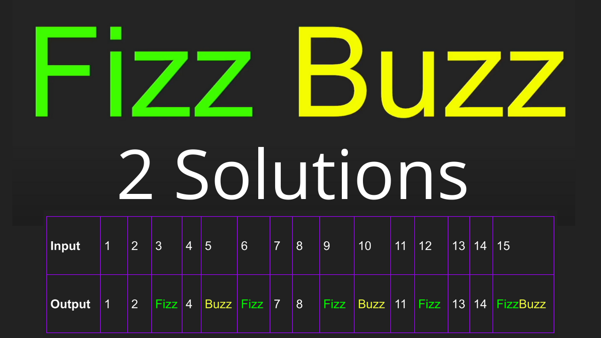

# Fizz Buzz

YouTube Link: https://youtu.be/2LPx1Ya1HHk

In this video we solve a common interview question Fizz Buzz. After this video you will understand the problem and how to solve to it. We will solve fizz buzz using 2 different solutions.

Interesting fact Fizz Buzz is also a drinking game.

Problem Statement:

- Print numbers 1 to n (or store in an array)
- If the number is divisible by 3 print “Fizz”
- If the number is divisible by 5 print “Buzz”
- If the number is divisible by 3 and 5 print “FizzBuzz”
- If none of the above conditions are true print the number
